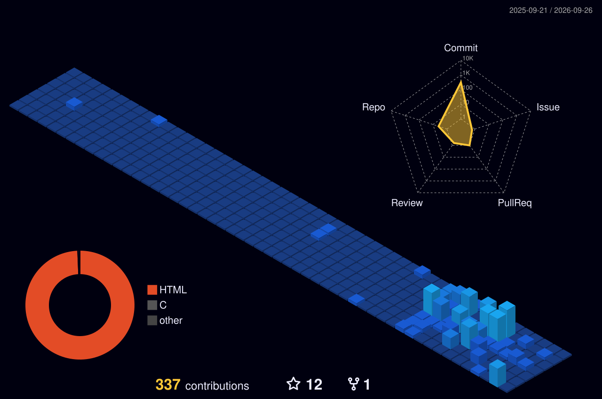

**Software Engineering Student | Full-Stack, Mobile & AI Developer | 42 Programmer**

## 💫 About Me

I'm a versatile developer who likes building practical, reliable software and understanding how complete systems fit together — from a React component down to a file descriptor.

- 💻 **Full-stack engineering** — React & TypeScript frontends, NestJS / Node.js / Spring Boot APIs, PostgreSQL schemas, auth & JWT, CI
- 📱 **Mobile development** — React Native & Expo; health tech with barcode scanning, Apple HealthKit, and nutrition APIs
- 🛰️ **Distributed systems** — Redis (caching, distributed locks, sessions), pub/sub event brokers, QUIC/TCP/UDP, WebSockets, concurrency & scalability
- 🔐 **Application security** — SSL/TLS, JWT & role-based access, TOTP MFA, rate limiting, input validation, CORS
- 🤖 **AI integrations** — building AI-assisted features that combine external APIs and structured data into real user experiences
- ⚙️ **Systems programming** — C, manual memory management, Unix I/O, Makefiles (42 curriculum)
- 📄 Co-authored a research paper on gamification in engineering education, presented at **IEEE INTEC'24** (Chicago, USA)

## 💻 Tech Stack

**Languages**

**Frontend & Mobile** — React, React Native, Expo, MEAN & MERN stacks

**Backend, Databases & Cloud**

**Data & AI**

   

**Tools, IDEs & Testing**

**Additional Technologies**

    

## 🌱 Currently

- 🧠 Deepening systems programming through the **42 curriculum**
- 🛰️ Exploring distributed architectures — event streaming, caching strategies, and scalability patterns
- 🤖 Building more AI-integrated features into real applications

## 🌐 Connect

 
 

